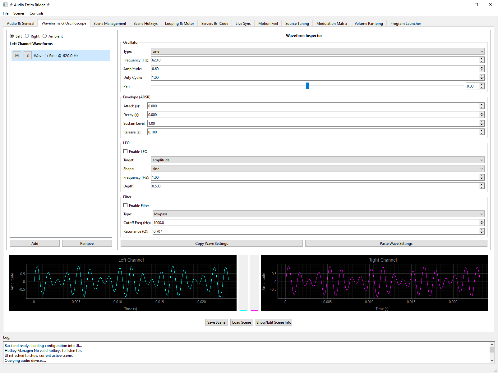

# 🔉 Audio E-stim Bridge 🌉 (AEB)

AEB is a powerful, real-time audio synthesis tool designed for controlling audio-driven electronic stimulation (e-stim) devices. It allows users to create complex, multi-layered, and dynamic audio signals that translate directly into physical sensations, all configurable through an intuitive graphical interface.

## ⚠️ WARNING: SERIOUS RISK OF ELECTRIC SHOCK ⚠️

This program generates audio signals intended to control high-voltage e-stim hardware. Misconfiguration or unexpected behavior could result in sudden, painful, or dangerous electric shocks. The creator is not a professional software developer, audio engineer, or electrical engineer. **Use this software entirely at your own risk. You have been warned!**



## ✨ Core Features

*   **Real-Time Synthesis Engine:** All audio is generated live. Any parameter change is reflected instantly in the output.
*   **Hybrid Layered Rendering Engine:** Build complex, physically-modeled objects by combining globally-panned "moving" layers with position-locked "zonal" layers. This allows for sensations like a moving ring revealing a foundational texture behind it.
*   **Virtual Axis Synthesis:** Derives complex, multi-dimensional sensations like twist, pressure, texture, pneumatics (compression/suction), and other conceptual physical effects from a single motion input, creating a rich physical experience from simple script data.
*   **Organic Drift Synthesis:** A specialized generative engine produces smooth, non-repeating, fractal motion (like wind or tide) to modulate parameters, preventing sensory habituation during long sessions.
*   **Graphical Motion Mapping:** A fully user-configurable graphical curve editor gives designers absolute control over how channel volumes respond to the primary motion input, moving beyond simple crossfades to a true positional amplitude mapping system.
*   **Per-Wave Spatial Mapping:** Use graphical curves on a per-wave basis to define positional volume gates, making textures appear or disappear as the primary motion passes through specific zones.
*   **Positional Ambient Envelopment:** Define a custom graphical curve to control the overall intensity of the ambient channel based on the primary motion input, creating effects like a sensation fading in with depth.
*   **Rhythmic Screen Flow Analysis:** Analyzes on-screen video content to extract the dominant rhythm and intensity. It translates visual motion energy directly into a phase-locked control signal, allowing the stimulation tempo to automatically accelerate and decelerate in sync with the action on screen.
*   **Seamless Scene Transitioning:** Load multiple, complete sound designs ("scenes") into a playlist and transition between them smoothly with a crossfade, triggered by hotkeys or automated by script events.
*   **Deep Modulation Matrix:** Achieve unparalleled creative control by modulating nearly any parameter in the engine—from audio filters and LFOs to the physics of the virtual axes themselves—using any available input source.
*   **Three-Channel Audio Architecture:**
    *   **Action Channels (Left/Right):** A traditional stereo pair driven by a primary motion source to create dynamic, panned sensations.
    *   **Ambient Channel:** A separate stereo audio bed for creating environmental or foundational sensations, with its own independent panning.
*   **Advanced Waveform Generation:** Layer multiple oscillators on each channel, choosing from Sine, Square, Sawtooth, Triangle, Noise, Additive Synthesis, and a full-featured Sampler.
*   **Signal Integrity & Dynamic Limiting:** A multi-stage defense-in-depth system ensures safe output. This includes **Safety Slew Limiting** to prevent instantaneous voltage jumps and **Dynamic Gain Scaling** which mathematically shrinks waveforms that exceed the safety limit, preserving their shape and texture without inducing distortion (hard clipping).
*   **Powerful Input Sources:** Control the audio with a variety of inputs including T-Code (WebSocket/UDP), Screen Flow, Audio Input Analysis, a bank of configurable System LFOs, and a virtual X360 Controller.
*   **Dual Control Layers: Global & Scene-Specific**
    *   **Global Actions & Hotkeys:** Define a personal, persistent set of hotkeys for application-level control (like switching scenes). These are saved locally and are never overwritten by loading a scene.
    *   **Scene Hotkeys & Modulation Matrix:** Define hotkeys *within* a scene file for creative, scene-internal logic. Create event-driven rules to modulate any parameter based on script dynamics, timers, or these scene-specific hotkeys.

## ⚙️ How it Works

AEB's core principle is to use **Input Sources** to generate normalized control values that drive the audio output. The control system operates on a strict hierarchy:

1.  **Primary Motion Source:** A single input (like T-Code L0 or the Internal Loop) provides a `0.0` (Proximal End) to `1.0` (Distal End) position value. This is the "script" that drives all motion.
2.  **Hybrid Layered Rendering:** The engine creates complex sensations by combining two types of layers on the Action Channels:
    *   **Moving Layers:** These create the core feeling of a moving point of contact, driven by a master panning algorithm.
    *   **Zonal Layers:** These create stationary textures that can appear or disappear as the moving layers pass through them.
3.  **Virtual Axis Synthesis:** The engine analyzes the *character* of the Primary Motion—its speed, acceleration, velocity, and "jolt"—to synthesize additional control sources for creating richer, more dynamic effects.
4.  **Global & Scene Hotkeys:** Key presses are checked first against Global Actions for app-level control, then passed down to the scene's Modulation Matrix for creative, scene-internal logic.
5.  **Motion Feel:** This system runs in parallel, providing an "easy mode" to add intuitive layers of sensation on top of the main movement using both real and synthesized T-Code axes.

## 💻 Installation

#### Easiest Method: Executable (Windows Only)
1.  **(Optional)** If you plan to use the X360 Controller input, download and install the [ViGEmBus Driver](https://github.com/nefarius/ViGEmBus/releases/latest).
2.  Download the latest **AEB executable** from the project's Releases page.
3.  Run the executable.

#### Recommended Method: Python (All Platforms, Latest Updates)
_Requires [Python](https://www.python.org/downloads/) (3.8+ recommended) to be installed and added to your system's PATH._

For maximum stability and to prevent conflicts with other Python packages, it is **recommended** to run AEB in a dedicated virtual environment.

1.  Clone this repository or download and extract the source code.
2.  Open a terminal or command prompt in the project's root directory.
3.  **Create a virtual environment:**
    ```sh
    python -m venv .venv
    ```
4.  **Activate the virtual environment:**
    *   On **Windows**:
        ```sh
        .venv\Scripts\activate
        ```
    *   On **macOS and Linux**:
        ```sh
        source .venv/bin/activate
        ```
    _Your terminal prompt should now be prefixed with `(.venv)`._
5.  **Install the required dependencies** into the active environment:
    ```sh
    python -m pip install -r requirements.txt
    ```
6.  **(Windows Only)** If you plan to use the X360 controller input, ensure the [ViGEmBus Driver](https://github.com/nefarius/ViGEmBus/releases/latest) is installed. The command in the previous step may prompt you to install this automatically.
7.  **Run the application:**
    ```sh
    python -m aeb
    ```

## ▶️ Getting Started: A Quick Guide

1.  **Launch AEB.**
2.  **Audio Setup (Audio & General Tab):** Select your dedicated **Audio Output Device**.
3.  **Set Up Global Controls (Scene Management Tab):**
    *   In the "Global Hotkeys" section, define your master control keys (e.g., F1, F2).
    *   In the "Global Actions" section, map those hotkeys to actions, like transitioning to specific scene indices in your playlist.
4.  **Design a Sound (Waveforms & Oscilloscope Tab):**
    *   Use the channel radio buttons to select a channel to edit.
    *   Click **`[ Add ]`** to add waves and edit them in the Inspector Panel.
5.  **Add Scene-Specific Logic (Scene Hotkeys & Modulation Matrix Tabs):**
    *   Use the **Scene Hotkeys** tab to define triggers for in-scene events.
    *   Use the **Modulation Matrix** to link those hotkeys (or script dynamics) to creative parameter changes.

## 🎛️ GUI Tabs Overview

*   **Audio & General:** Main audio device selection, master channel amplitudes, min/max volume ranges, and graphical curve editors for both the **Action Channel Motion Mapper** and the **Positional Ambient Mapper**.
*   **Waveforms & Oscilloscope:** The main sound design area for the currently active scene.
*   **Scene Management:** The "performance control" center. Manage your **Scene Playlist**, define your persistent **Global Hotkeys**, and map them to **Global Actions**.
*   **Scene Hotkeys:** Define hotkeys that are saved *with the current scene*. These are used as sources in the Modulation Matrix for scene-specific effects.
*   **Looping & Motor:** Controls for the built-in automatic motion pattern generator.
*   **Servers & TCode:** Enable and configure the WSDM client, UDP server, and Virtual X360 Controller.
*   **Live Sync:** Controls for real-time synchronization. **Screen Flow** performs rhythmic motion analysis on video content, while **Audio Input Analysis** creates sources from system audio.
*   **Motion Feel:** The "easy mode" for adding intuitive effects based on both real and synthesized T-Code axes.
*   **Source Tuning:** A dedicated tab for advanced, "power-user" configuration of all internal and virtual modulation sources. Includes controls for **Signal Safety & Integrity**, **System LFOs**, **Drift**, **Thermodynamics**, **Viscoelastic Physics**, **Inertial Mass**, **Pneumatics**, and **Primary Motion Dynamics**.
*   **Modulation Matrix:** The "expert mode" for creating custom, conditional rules to modulate any parameter from any source.
*   **Volume Ramping:** Fine-tune the automatic fade-in/fade-out behavior.
*   **Program Launcher:** Configure external programs to launch automatically.

## 💾 Configuration & File Types

Settings are saved automatically. The system uses two types of configuration files:

1.  **`config.yaml`:** This file saves your personal, machine-specific settings. This includes your audio devices, server ports, **Global Hotkeys**, and **Global Actions**. This file is **not** meant to be shared.
2.  **Scene `.json` files:** These can be either a **Single Scene** or a **Scene Pack**.
    *   **Single Scene:** Contains the entire creative "experience"—all sound design, **Scene Hotkeys**, modulation rules, etc.
    *   **Scene Pack:** A special `.json` file that contains a playlist of multiple, complete scenes embedded within it. This allows a single, portable file to contain a complete, multi-part experience.
    *   These files are designed to be shared. Loading a scene or pack will **never** overwrite your personal Global Hotkeys or Actions.

## 🤖 Advanced Usage & AI Scene Generation

For power users and developers, a comprehensive **Technical Specification** document is available on the [wiki](https://github.com/ferocioustoast/AEB/wiki/Technical-Specifications). This document details the entire `.json` file structure and is the definitive guide for manual editing or for providing context to an AI assistant (like ChatGPT, Claude, or Gemini) to generate new, creative scenes for you.

## 📜 Disclaimer

This software is provided "as is", without warranty of any kind. By using this software, you acknowledge the inherent risks of electronic stimulation and agree to take full responsibility for your own safety.